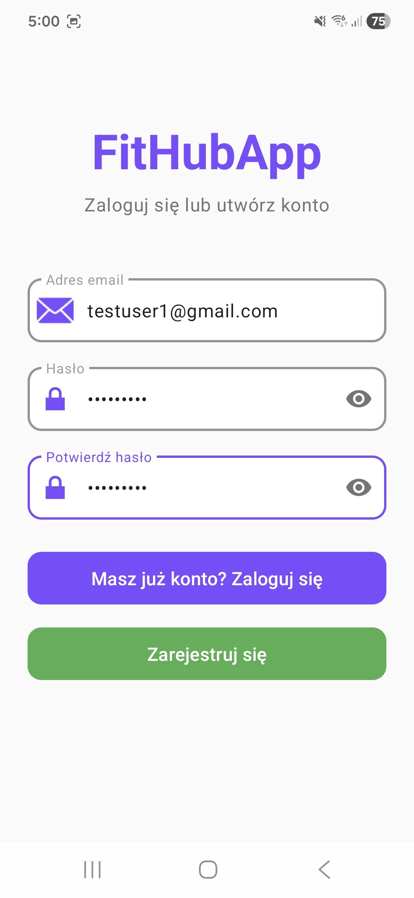
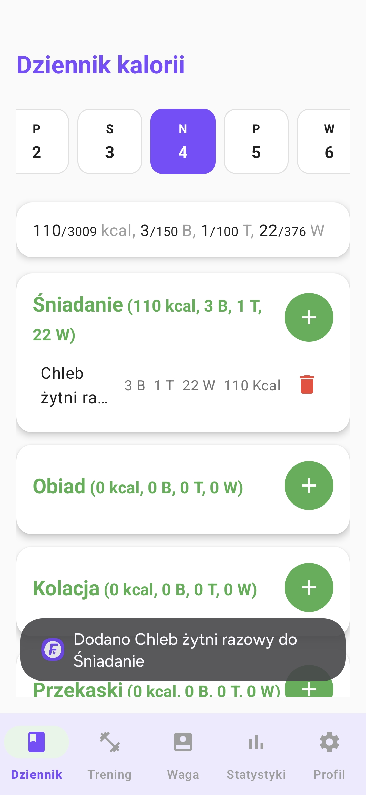
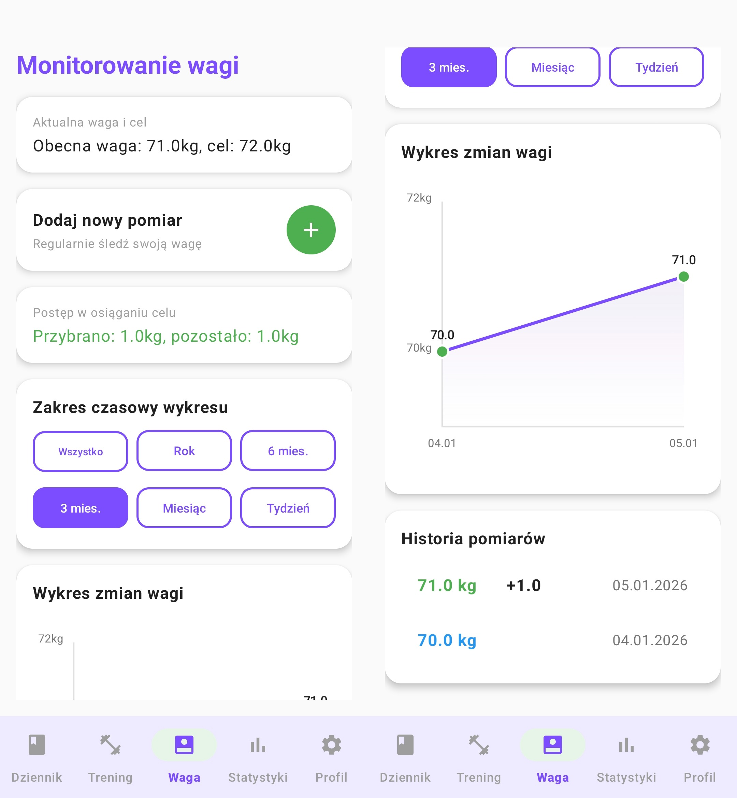
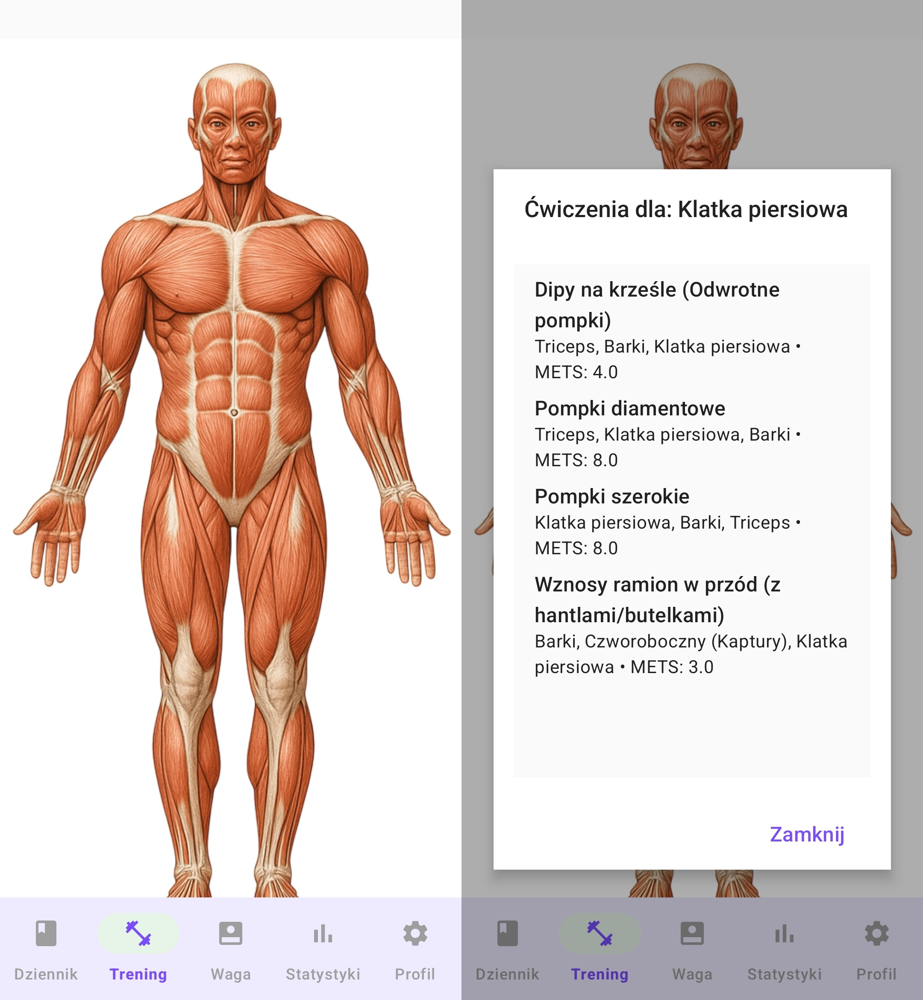
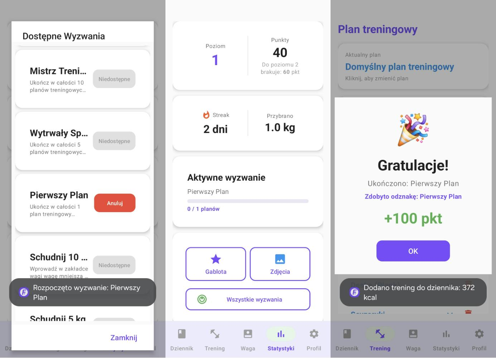

# FitHub

A mobile application that brings diet tracking, workout planning, and progress monitoring together in one place. Built as an engineering thesis project at the University of Silesia, FitHub addresses a common gap in fitness apps: most focus on a single area (only diet, or only training), forcing users to juggle several disconnected tools. FitHub combines them into a single, coherent system.

> The application interface is in Polish.


## Features

- **Calorie diary** — log meals per day with automatic macro calculation. Products can be searched by name, added manually, or scanned via barcode. Completed exercises are logged as negative calories, so the daily balance is a single running total.
- **Interactive muscle model** — tap a muscle group on an anatomical model to see suggested exercises for that area, each with instructions and an instructional video.
- **Workout plans** — build custom training plans from an exercise library and log a whole plan or a single exercise to the diary; burned calories are computed from body weight, duration, and the exercise's MET value.
- **Weight tracking** — record measurements and view changes over time on a chart with selectable time ranges (week, month, 3/6 months, year, all).
- **Gamification** — points, levels, badges, predefined challenges, and a daily login streak to support long-term engagement.
- **Progress photos** — store dated photos tagged with the user's weight at the time.
- **Google Health Connect integration** — automatically import step counts and weight measurements from smart watches and scales.

## Screenshots

| Login | Calorie diary | Weight tracking |
|-------|---------------|-----------------|
|  |  |  |

| Interactive muscle model | Progress & challenges |
|--------------------------|-----------------------|
|  |  |

## Architecture

FitHub uses a three-tier client–server architecture:

- **Client** — native Android app (Kotlin) handling the UI, input validation, and core logic such as calorie calculations.
- **Server** — Node.js + Express REST API, containerized with Docker and deployed on Microsoft Azure. Acts as the intermediary between the app and the database, handling authorization, validation, and persistence. The backend lives in a separate repository: [fithub-backend](https://github.com/kamknap/fithub-backend).
- **Database** — MongoDB (hosted on MongoDB Atlas), accessible only through the server.

The app and server communicate over HTTPS using a REST API with JSON payloads. Keeping the database behind the server improves security and allows each layer to be developed and tested independently.

## Tech stack

**Mobile client**
- Kotlin, Android Studio, Material Design 3
- Retrofit + Gson (networking), Kotlin Coroutines (async)
- ZXing (barcode scanning), WorkManager (background tasks & notifications)
- Custom `Canvas`-based chart for weight history
- WebView + SVG/JavaScript bridge for the interactive muscle model

**Backend**
- Node.js, Express, Mongoose
- MongoDB Atlas
- Docker, Microsoft Azure

**Authentication**
- Firebase Authentication (passwords are never stored in the app's own database)

## External integrations

- **Open Food Facts API** — nutritional data for food products
- **Google Health Connect** — syncing steps and weight from smart devices
- **YouTube** — hosting instructional exercise videos

## Testing

Quality assurance combined several testing levels:
- **Unit tests** (JUnit) for calculation logic such as BMI, BMR, and calorie burn
- **Integration tests** (Postman) for server–database and external-service communication, scripted for automation and ready to run in a CI/CD pipeline
- **Acceptance tests** run manually against key user scenarios
- **Non-functional checks** for interface responsiveness and server response times

## Getting started

This repository contains the **Android app**. The REST API is in a separate repository: [fithub-backend](https://github.com/kamknap/fithub-backend).

**Prerequisites**
- Android Studio
- A running instance of the [fithub-backend](https://github.com/kamknap/fithub-backend) API
- A Firebase project for authentication

**Run the app**
```bash
git clone https://github.com/kamknap/FitHub.git
```

1. Open the project in Android Studio and let Gradle sync.
2. Set the backend API base URL and add your Firebase configuration (`google-services.json`).
3. Run the app on an emulator or a physical device.

> See the [fithub-backend](https://github.com/kamknap/fithub-backend) repository for instructions on running the server and database.

## Roadmap

- Optimize the server to reduce cloud container cold starts
- Estimate meal portions instead of relying solely on weight in grams
- Add GPS-based activity tracking (running, cycling)
- Use AI to estimate meal nutrition from text or photos

## Author

Kamil Knapik — engineering thesis, Computer Science, University of Silesia in Katowice (2025/2026).
